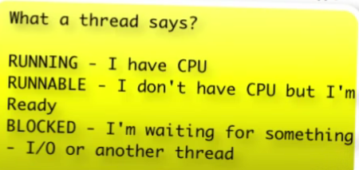

<!-- TOC -->
* [Threading](#threading)
  * [Ways of creating threads](#ways-of-creating-threads)
  * [Thread states](#thread-states)
  * [Thread Priority](#thread-priority)
  * [join](#join)
* [Executor Framework](#executor-framework)
  * [SingleThreadExecutor](#singlethreadexecutor)
  * [Different ways to create executor thread](#different-ways-to-create-executor-thread)
  * [Future](#future)
    * [Callable Class](#callable-class)
  * [Invoke multiple callable](#invoke-multiple-callable)
  * [InvokeAny](#invokeany)
  * [Terminate Executor](#terminate-executor)
<!-- TOC -->

# Threading
## Ways of creating threads

- Using thread super class

```agsl
public class UsingThreadSuperClass extends Thread{
    @Override
    public void run() {
        System.out.println("Inside thread creation by extending Thread class");
    }
}
```

- Using Runnable Class

```agsl
public class UsingRunnableInterface implements Runnable{
    @Override
    public void run() {
        System.out.println("Created thread using Runnable interface");
    }
}
```

- Accessing these 2 methods

```agsl
Thread thread1 = new UsingThreadSuperClass();
thread1.start();
Thread thread2 = new Thread(new UsingRunnableInterface());
thread2.start();
```

## Thread states

When thread is started, it can be in anyone of this state.


1. New - Thread is created
```agsl
Thread thread1 = new UsingThreadSuperClass();
```
2. Runnable 
3. Running
4. Blocked/Waiting
5. Terminated/Dead - If thread is completed, then it will be in Terminated/Dead state

## Thread Priority

- Default priority of thread is '5'
- Priority can be increased/decreased in range 1-10
- If 2 threads are waiting then high priority thread will be chosen. 
```agsl
thread2.setPriority(Thread.MAX_PRIORITY);

MIN_PRIORITY = 1
NORM_PRIORITY = 5
MAX_PRIORITY = 10
```

## join

thread.join() method call force the execution to stop until thread completes execution.

thread1 will wait until thread2 completes

thread.join(1000) - thread waits for only 1s to complete
```agsl
Thread thread1 = new Thread(() -> System.out.println("Thread 1 executing"), "Thread 1");
Thread thread2 = new Thread(() -> System.out.println("Thread 2 executing"),"Thread 2");
Thread thread3 = new Thread(() -> System.out.println("Thread 3 executing"),"Thread 3");
thread3.start();
thread2.start();
thread2.join();
thread1.start();
```

# Executor Framework

## SingleThreadExecutor

- Create only 1 thread.
- If we have multiple execute(or task) then it execute 1 after another.

```agsl
 ExecutorService executorService = Executors.newSingleThreadExecutor();
 executorService.execute(new Runnable() {
    @Override
    public void run() {
        System.out.println("\nTask3 Ended");
    }
});
 executorService.execute(() -> System.out.println("\nTask4 Ended"));
```
## Different ways to create executor thread

- SingleThreadExecutor
```agsl
ExecutorService executorService = Executors.newSingleThreadExecutor();
```

- FixedThreadPool
```agsl
Executors.newFixedThreadPool(10);
```

- ScheduledThreadPool
```agsl
Executors.newScheduledThreadPool(10);
```

## Future

- Executor.submit will return Future object

### Callable Class

CallableRunner.java
```agsl
class CallableTask implements Callable<String>{
    String name;
    public CallableTask(String name){
        this.name = name;
    }
    @Override
    public String call() throws Exception {
        return "Hello from "+ name;
    }
}

public static void main(String[] args) throws ExecutionException, InterruptedException {
    ExecutorService executor = Executors.newFixedThreadPool(1);
    Future<String> str = executor.submit(new CallableTask("Task 1"));
    System.out.println("str : "+ str.get());
    executor.shutdown();
}
```
## Invoke multiple callable
Future value is returned only after executing all the callable task
```agsl
ExecutorService executorService = Executors.newFixedThreadPool(1);
List<CallableTask> tasks = List.of(new CallableTask("Task 1"), new CallableTask("Task 2")
        , new CallableTask("Task 3"));
List<Future<String>> invokeAll = executorService.invokeAll(tasks);
```

## InvokeAny

InvokeAny - Return first thread which completes the execution
```agsl
List<CallableTask> tasks = List.of(
        new CallableTask("Task 1"),
        new CallableTask("Task 2"),
        new CallableTask("Task 3"));
String invokeAny = executorService.invokeAny(tasks);
```
## Terminate Executor
If we didn't call shutdown, executor won't stop.
```agsl
executorService.shutdown();
```