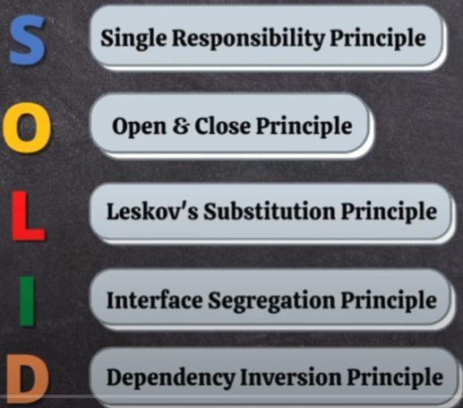

# SOLID



## Single Responsibility Principle(SRP)

- Every class must perform a single functionality

**WithoutSRP.java** - Contains all functionality(Notification, loan, printer, bank) dumped in single java file. 
Created separate class to handle each functionality.

## Open-Close Principle(OCP)

- States that according to the new requirements the module should be open for extension but closed for modification.

**WithoutOCP.java**

If we need to send OTP to whatsapp, then we have to modify existing code.
```agsl
public void sendOTP(String medium){
    if(medium.equals("email")){
        // Email Logic
    }
    if(medium.equals("mobile")){
        // Mobile Notification
    }
}
```

## Liskov's Substitution Principle(LSP)

- It states that **any instance of a subclass should be able to be replaced by an instance of its superclass without affecting the correctness of the program.** 
- In other words, **objects of a superclass and its subclass should be able to be used interchangeably.**

Instragram.java & WhatsApp.java doesn't follow LSP since it doesn't support groupVideoCall & publishPost respectively where subclass instance can't be replaced with superclass

**Solution**

Solution is available in org/example/lsp/solution/ package.

- Create common features in an interface
**SocialMedia interface**
```agsl
public void chatWithFriend();
public void sendPhotosAndVideos();
```

- Create specific features in another interfaces - SocialVideoCallManager & PostMediaManager

## Interface Segregation Principle(ISP)

- It states that a **client should not be forced to depend on methods it does not use.**
- In other words, an interface should be designed with a specific set of methods for a specific client rather than a one-size-fits-all approach.

**UPIPayments.java**

Only Google Pay supports getCashBackAsCreditBalance. PhonePe & Paytm doesn't support it.
```agsl
public void payMoney();
public void getScratchCard();
public void getCashBackAsCreditBalance();
```

**Solution**

org/example/isp/solution

- Create common features in 1 interface and optional in another interface.

## Dependency Inversion Principle(DIP)

- It states that **high-level modules should not depend on low-level modules**.
- Both should depend on abstractions. Abstractions should not depend on details. Details should depend on abstractions. 
- This principle encourages the use of interfaces to achieve loose coupling between classes.

```agsl

```